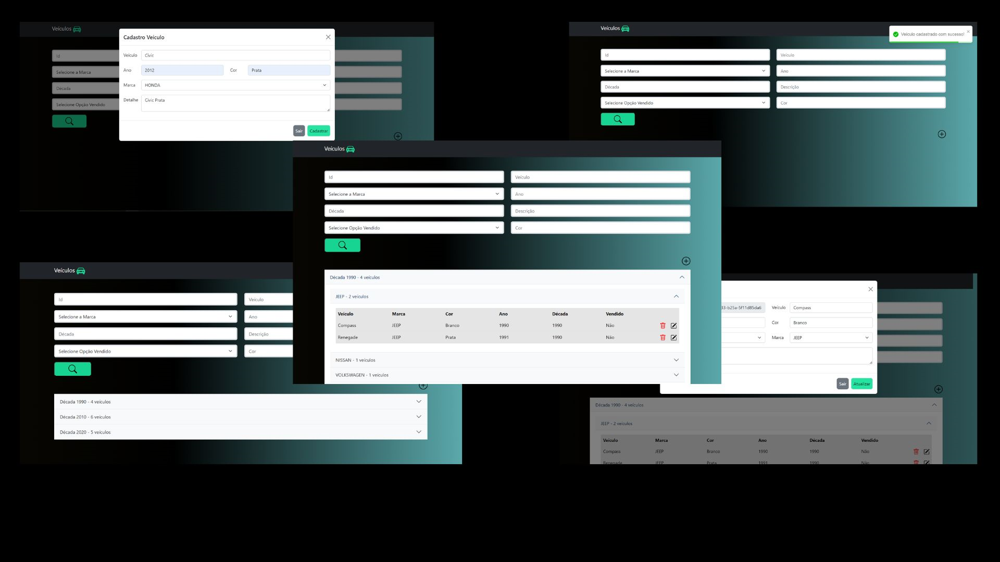

### Tecnologias utilizadas
- React
- Bootstrap 5
- Typescript



### Configuração
1) Após clonar e importar para sua IDE, é necessário rodar o comando:
```
npm install
```

2) Para startar a aplicação, basta rodar o comando:
```
npm start
```

Para acessar o front basta acessar o link: http://localhost:3000
